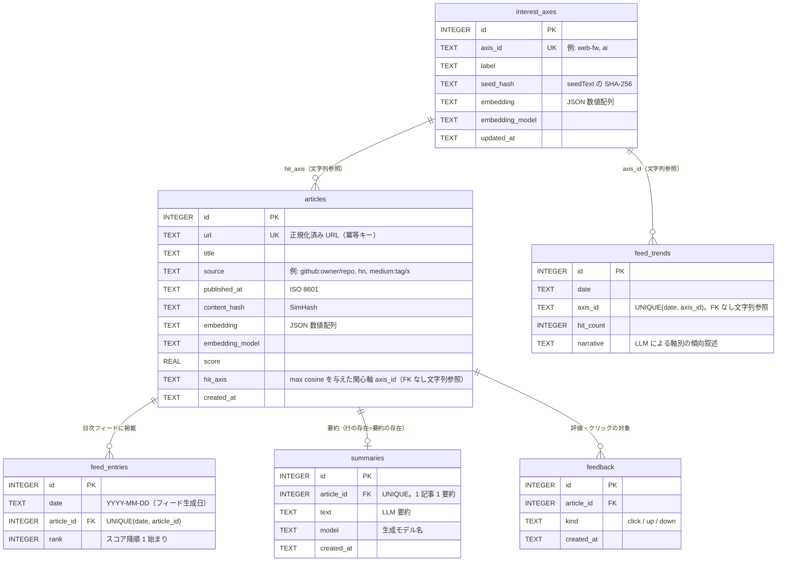

# ER 図（D1 スキーマ）

`app/migrations/0001_init.sql`〜`0002_summaries_table.sql` に対応する。

## 用語: 「フィード」の2つの意味

- **ソースフィード**: 収集元の外部 RSS/Atom フィード（例: `https://medium.com/feed/tag/technology`）。
  DB には持たず KV の設定（`sources.feeds`）にあり、記事側には `articles.source` として出自ラベルだけ残る。
- **フィード（feed_entries）**: このプロダクトが毎日生成して画面に出す記事一覧のこと。
  `feed_entries` の "feed" はこちらを指す。外部フィードとは無関係。

## 補足

- 要約は `summaries` に `article_id` 起点で永続する（1 記事 1 行。「要約がある」= 行が存在する。
  nullable 列を作らない設計）。`feed_entries` は日次パス再実行で当日分を delete→insert するが、
  要約は `feed_entries` に持たないためこの入れ替えで消えない。
- フィード項目と要約の対応は保存しない。`feed_entries.article_id` → `summaries.article_id` の結合で
  導出する（日付には依存しない）。
- digest モデルを切り替えても既存の要約は再生成されない（`summaries` は `article_id` で 1 記事 1 行。
  新モデルで作り直す場合は該当行の削除が必要）。
- URL を持つのは `articles.url` のみ。`feed_entries` / `feedback` は ID 参照だけで URL を持たない。
- `feedback` は `feed_entry_id` を API で受け取るが、保存時に `article_id` へ解決している
  （`app/src/viewer/feedback.ts`）。どの日の掲載から評価が発生したかは保存していない。
- `hit_axis` / `axis_id` は意図的に FK にしていない: 関心軸の削除・再定義で過去の
  `articles.hit_axis` / `feed_trends` を孤立させないため（`app/src/viewer/settings.ts` 冒頭コメント参照）。
